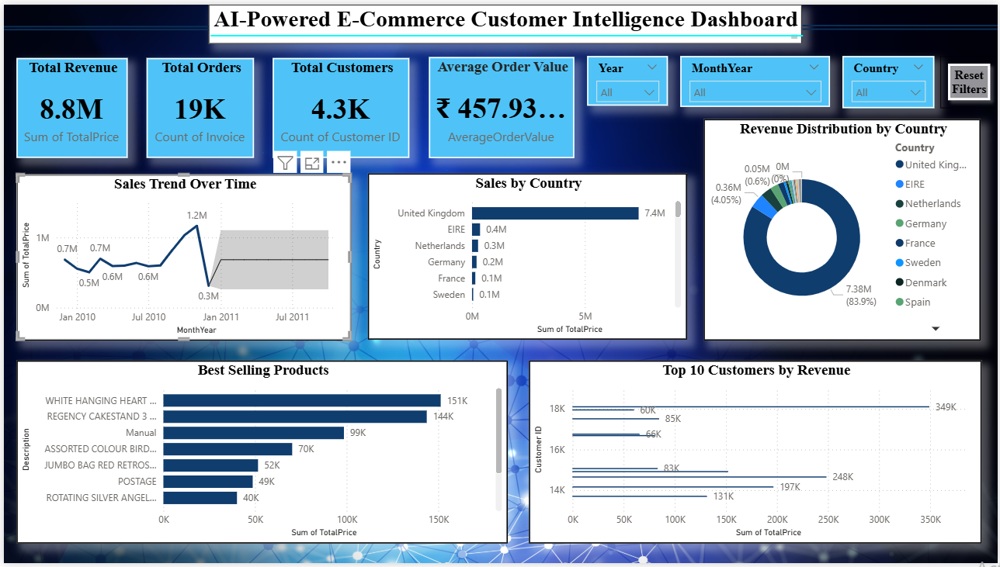
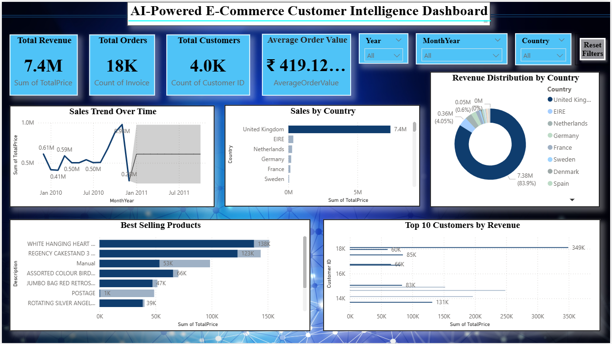

🚀 Built as part of Data Analyst Internship Portfolio

# 🛒 AI-Powered E-Commerce Customer Intelligence Dashboard

🚀 End-to-End Data Analytics Project using Python & Power BI

---
##  Overview
This is an end-to-end data analytics project covering data cleaning, analysis, and visualization.

## 📌 Problem Statement
E-commerce businesses generate large volumes of customer data, but struggle to extract meaningful insights for improving sales and customer retention.
---
## 💡 Business Impact
- Helps identify high-value customers
- Supports targeted marketing strategies
- Improves decision-making using data insights
 
## 🎯 Objective
- Analyze customer purchasing behavior
- Identify high-value customers
- Improve business strategy using data insights

---

## 🛠️ Tools Used
- Power BI (Dashboard)
- Python (Data Cleaning - Pandas, NumPy)
- Excel

---

## 🧹 Data Cleaning Process
- Removed null values
- Handled duplicates
- Converted data types
- Created new features like AOV

---

## 📊 Dashboard Preview

### 📈 Sales Overview

### 👥 Customer Insights

---

## 🔍 Key Insights
- Top 20% customers contribute majority of revenue
- Repeat customers have higher Average Order Value
- Sales show strong seasonal trends

---

## 💡 Business Impact
- Helps identify high-value customers
- Improves targeted marketing strategies
- Supports data-driven decision making

---
## 📊 Dataset Source

Dataset taken from Kaggle:  
https://www.kaggle.com/datasets

- Cleaned dataset available as `cleaned_ecommerce_data.csv`
- Can be opened in Excel or used for analysis

⚠️ Note: Dataset cleaned and preprocessed using Python.

---

## 🚀 How to Use
1. Download the repository files  
2. Open the `.pbix` file using Power BI Desktop  
3. Interact with the dashboard to explore insights  

---

## 👩‍💻 Author
Deepali P Hanvate
